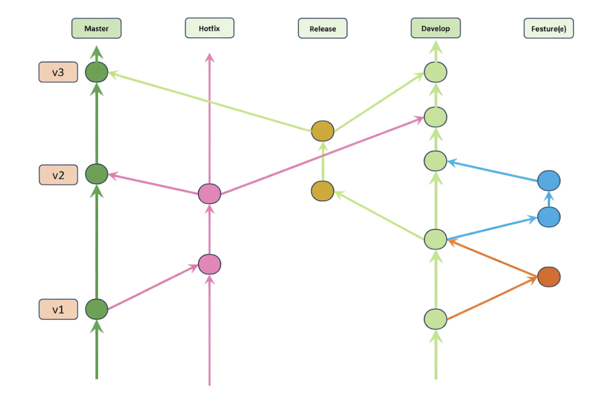

# Особенности реализации git-flow в проекте

## **О git flow**
Git flow - модель ветвления, в репозиториях, при которой поддерживаются определённые правила:
- Репозиторий работает с двумя основными ветками:
    - `main(master)` - ветка, в которой хранится продакшн код и совершать коммиты напрямую запрещено
    - `develop(dev)` - ветка, в которой хранится и собирается код активной разработки, прямой коммит в эту ветку так же запрещён
-  Есть основные группы(префикса) веток, которые являются короткоживущими:
    - `feature/*` - группа веток, которая всегда наследуется от `develop` ветки, внутри которой происходит разработки нового функционала проекта или исправление багов например. Как только работа над этой частью проекта была завершена, изменения подливаются в `develop` ветку.
    - `release/*` - группа веток, в который происходит сборка версий проекта из develop ветки, его тестирование, дебаг, исправление ошибок. В результате изменения подливаются в `main` ветку.
    - `hotfix/*` - группа веток, в которой происходят быстрые критические изменения в `main(master)` ветке и изменения подливаются в `main(master)` ветку.
- Все `merge` происходят с помощью `Pull Request`, что позволяет производить ревью кода от коллег перед пушем той или иной части кода.  
### **Особенности**
0. [Схема ветвления:](#схема-веток)
    - `feature/*` - исходит от `develop(dev)` ветки, происходит работа над фичей и мердж в `develop`, затем удаление ветки
    - `hotfix/*` - группа веток, в которой происходят быстрые критические изменения в `main(master)` ветке. 
    После завершения изменения подливаются **в обе ветки**: `main` (для продакшна) и `develop` (чтобы исправление не потерялось в будущих версиях).
    - `release/*` - исходит от `develop` ветки, происходит сборка версии, тестирование и мердж в `main(master)` и `develop(dev)`
1. Такая структура веток позволяет нам явно разделять продакшн код от кода в разработке
2. `Pull Request’s` - помогают с проверкой работоспособности того или иного решения, с помощью код ревью от коллег или `GitHub Copilot`
3. Несколько возможностей реализации данной модели:
    - С помощью CLI утилиты `git flow`:
        ```bash
        git flow init #инициализация flow в репозитории
        git flow hotfix start critical-fix #старт хотфикса
        git flow hotfix finish critical-fix #финиш хотфикса
        git flow feature start add-new-service #старт работы над новой фичей
        git flow feature finish add-new-service #финиш работы над новой фичей
        # и так далее
        ```
        Такой подход позволяет нам сократить все рутинные действия:
        - Создание ветки
        - Перемещение в ветку для работы
        - Удаление ветки после завершения работы 
        - Мердж в нужную ветку наших изменений
        - Гибкая настройка групп веток и пути куда мерджить результат
    - Ручное управление:
        Ручной подход дает полный контроль над процессом, но требует внимательности и знания точной последовательности действий.  
        Пример для `feature` ветки:
        ```bash
        git checkout develop              # переключаемся на актуальную develop
        git pull origin develop           # обновляем локальную копию
        git checkout -b feature/auth      # создаем и переключаемся на ветку фичи

        # Работа над фичей
        git add .
        git commit -m "Add auth service"

        # Завершение фичи
        git checkout develop               # возвращаемся в develop
        git pull origin develop            # обновляем на случай изменений
        git merge feature/auth             # вливаем фичу с сохранением истории
        git branch -d feature/auth         # удаляем ветку фичи
        git push origin develop  
        ```
        Такой подход может провоцировать за собой большее количество ошибок, так как в отличии от `git flow CLI`, здесь нету автомацизации, всё требует ручной работы.

#### Схема веток
      

   На данной схеме более наглядно продемонстрирована схема ветвления, о которой более подробно рассказано [здесь](#особенности).


## **Git Flow в моём проекте**
Модель `Git Flow` мне показалась, намного более применимой, особено в комбинации с `git flow CLI`, для разработки данного проекта, так как добавляется возможность code review, улучшается структура коммитов и по графу репозитория можно будет удобно отследить все изменения.  
Как я планирую настраивать `git flow` в проекте:
- Запрет на прямые коммиты в `main` ветку
- Поскольку по тз мы должны использовать только `main` ветку: 
    - Все `feature/*` ветки будут исходить от `main(master)`
    - У нас отсутсвует возмоность использования веток `release/*`, так как все `feature/*` ветки мерджатся сразу в `main(master)`
- Все фичи только в `feature/*` ветках, с мерджем через `Pull Request`
- Все быстрые изменения так же без изменений располагаются в `hotfix/*` ветках и исходят от `main(master)` с дальнейшем мерджем в `main(master)` так же через `Pull Request`